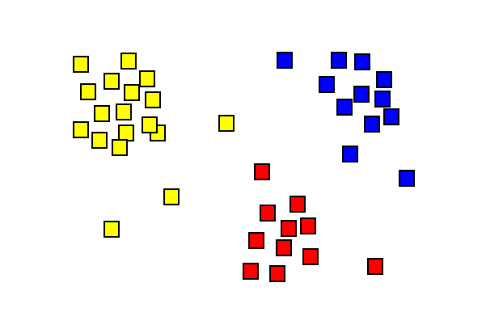

<h2>KNN Consensus Clustering Algorithm</h3>
<h4>Honours Project 2021 - Implementation of a KNN Consensus Clustering Algorithm Based On the K Means Algorithm</h4>

 
Steps for running the code:

1. Download and unzip repository

2. Open cmd

3. Install jupyter notebook with pip install jupyter

4. In the file location of the repository open cmd

5. Run the notebook with python -m notebook

6. Run the required setup file within the repsoitory

7. In jupyter notebook run the generate logs ipynb file

<b>Now any of the clustering ipynb files will work and cluster the generated data accordingly. </b>

<i>Note: This algorithm utilizes supporting algorithms which are the agglomerative and HDBScan algorithms. Full report is included in the repository.</i>

